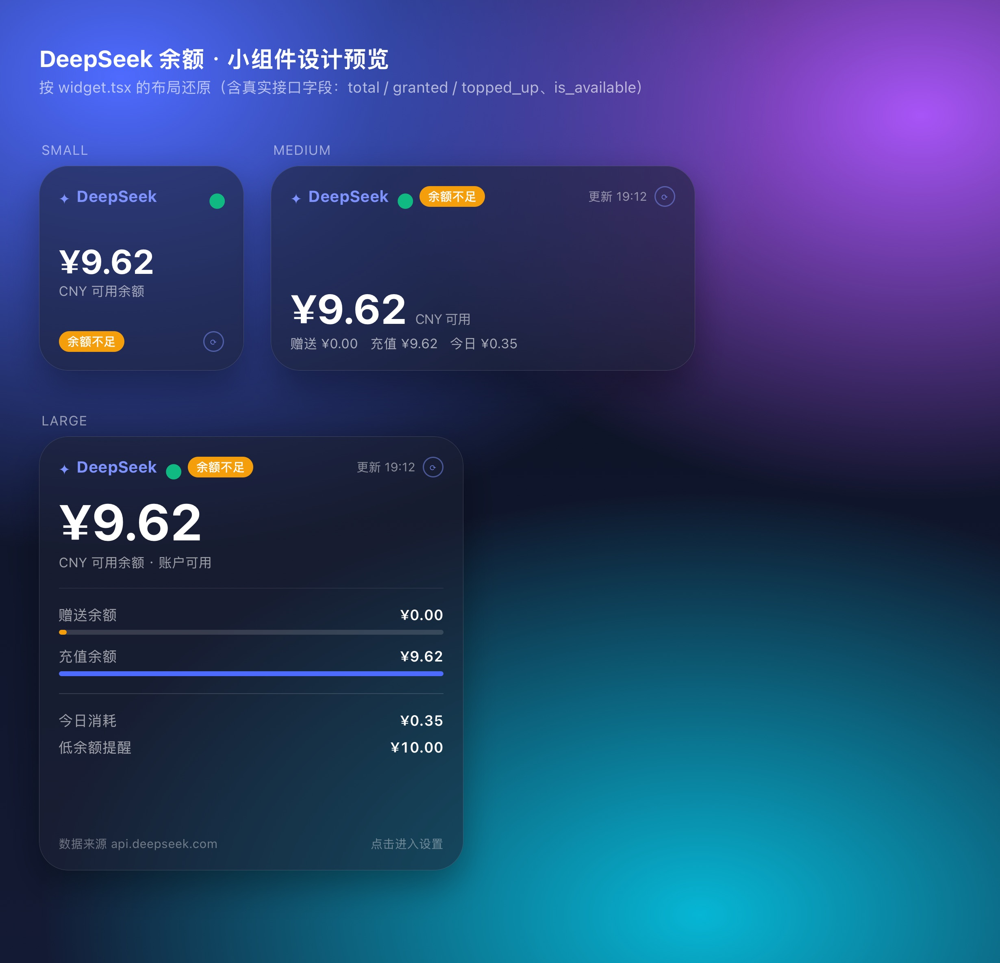

# DeepSeek 余额 · Scripting 小组件

用 [Scripting](https://scripting.fun)（iOS 上的 TypeScript + TSX 运行时）写的 DeepSeek API 余额小组件。

| | |
| --- | --- |
| 应用 | [Scripting · App Store](https://apps.apple.com/cn/app/scripting/id6479691128)（免费） |
| 项目 | [`deepseek-balance/`](./deepseek-balance) |
| 版本 | 1.0.3 |
| 接口 | `GET https://api.deepseek.com/user/balance` |



## 📲 一键安装

在 iPhone 上点击（需先装好 Scripting）：

```
scripting://import_scripts?urls=%5B%22https%3A%2F%2Fraw.githubusercontent.com%2Fzhiaon%2Fscripting-deepseek-balance%2Fmain%2Fdeepseek-balance.zip%22%5D
```

安装后到主屏幕长按 → 添加 Scripting 小组件 → 编辑小组件 → Script 选 **DeepSeek 余额**。

## ✨ 功能

- 余额大字显示（等宽数字、圆角字体），自动按接口返回的 `balance_infos` 选择币种（CNY 优先）
- 赠送 / 充值余额明细、今日消耗（基于每日余额快照估算）
- 低余额提醒（默认 ≤ ¥10），账户可用状态
- 请求失败回落本地缓存并标注「离线」
- API Key 存 iOS Keychain（按脚本隔离）
- 支持小组件参数：`{"currency":"USD","refreshMinutes":15,"lowThreshold":20}`

## ⚙️ 使用

1. 运行一次脚本 → 在设置页粘贴 `sk-...` → 保存 API Key
2. 主屏幕添加小组件 → 编辑 → 选择「DeepSeek 余额」

## 🔧 更新

`script.json` 的 `remoteResource` 指向 `deepseek-balance.zip`，在 Scripting 里重新加载脚本即可拉取最新版。
